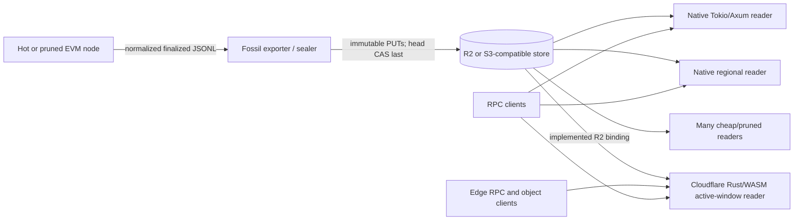
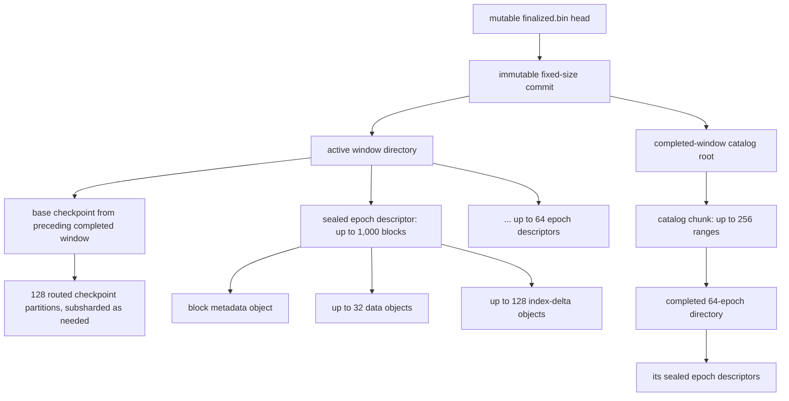
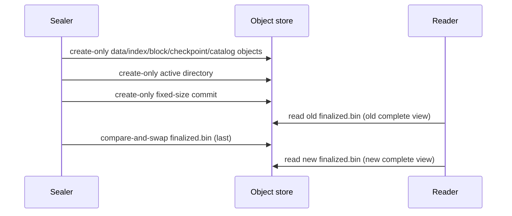

# Architecture and storage walkthrough

Fossil has one writer path, one binary format, and one centralized immutable object
backend. Native readers can be disposable and aggressively pruned because the shared
R2/S3-compatible store is authoritative.

## Deployment



Plain-text fallback:

```text
hot/pruned node -> exporter/sealer -> one R2/S3-compatible object store
                                      |       |        |
                                      v       v        v
                                  native   native   Rust/WASM Worker
                                  reader   reader   (active-window decoder)
```

There is no DHT, peer routing, or federation. Scale comes from many stateless readers
sharing one backend and bounded caches. The Rust/WASM Worker reads the standard
publication head and immutable objects below `fossil-demo/`, serves the bounded
balance/nonce/code/storage JSON-RPC subset for the active window, and retains a
read-only gateway restricted to canonical immutable SHA-256 CAS keys. Completed-window
and checkpoint fallback remain native-only;
log serving is not implemented. See [deployment](deployment.md) for runtime details.

## Publication object hierarchy



Plain-text fallback:

```text
head -> commit -> active directory -> base checkpoint
                              |
                              +-> up to 64 epoch descriptors -> blocks/data/index
commit -> catalog root -> catalog chunk -> completed 64-epoch directory

rollover: catalog the completed directory; build its closing checkpoint;
          make that checkpoint the base of a new empty active directory
```

An epoch contains at most 1,000 blocks. A window contains 64 sealed epoch
descriptors, so it spans at most 64,000 blocks; smaller accepted epochs produce a
shorter block range. The completed month stress test fixed `--chunk-blocks 1000`, so
its arithmetic used full 1,000-block epochs:

```text
30 * 24 * 60 * 60 / 2 = 1,296,000 blocks
1,296,000 / 1,000      = 1,296 epochs
1,296 / 64             = 20 complete windows, 16 active epochs
```

It completed all 1,296 epochs in **9,449.0865 seconds (2h37m29s)** and produced
**234,368 immutable objects** totaling **23,277,861,710 logical bytes**. The object
counts include 41,472 data, 165,888 index, 23,060 checkpoint, 1,316 directory, 40
catalog, and 1,296 commit objects. See the
[checked compact artifact](../benchmarks/results/base-shaped-month.json); its full
progress result has SHA-256
`c72c2960789cbf6000c42624dacaab03d70939a239747149dc3825d901c977c4`.

The catalog rolled through 20 completed-window entries in that run. Its chunks hold
256 entries and its root holds 4,096 chunk references, so month arithmetic is
comfortably within both bounds. Publication progress was checkpointed after every
sealed epoch by the manual benchmark; checkpoint and catalog creation happened after
every 64th descriptor. The run used the filesystem backend and synthetic
Base-cardinality-shaped input. It is not production R2 performance, a publication of
the measured real Base range, or authoritative, semantically complete forward EVM
state.

## Concrete object names

For chain ID 8453 (`0x2105`), the only mutable key is:

```text
chains/0x2105/heads/finalized.bin
```

Every other object is immutable and content-addressed:

```text
objects/sha256/7a/7a41c0...<64 lowercase digest hex total>
objects/sha256/d3/d35bc9...<64 lowercase digest hex total>
```

The abbreviated digests above are **illustrative, not computed object hashes**. An
object reference contains the full 32-byte SHA-256 digest and exact encoded length.
The key derives from that digest. The head contains a reference to a fixed-size commit;
the commit references an active directory and, after the first rollover, a completed
catalog. Together these objects form the existing [Merkle DAG](integrity.md), rooted
at the immutable commit digest; normal reads verify the paths they traverse.

## Route, fingerprint, index, and data

Logical state keys begin with a namespace byte:

```text
account:  0x01 || address
storage:  0x02 || address || incarnation_u64 || slot
code:     0x03 || code_hash
```

For account/storage keys, `SHA256(address)[0] >> 1` chooses one of 128 router
partitions. Four router partitions map to one of 32 data partitions. Separately,
`SHA256(full encoded key)[0..12]` is the 96-bit candidate fingerprint, equivalently
`SHA256(namespace || logical payload)[0..12]`. Because the full encoded key shown
above already starts with its namespace byte, the namespace is never prepended twice.
The route and sample fingerprint below are **illustrative, not computed**:

```text
address       = 0x1111111111111111111111111111111111111111
router        = 37
partition     = floor(37 / 4) = data object 9
fingerprint   = 8f21a49b3cc0d771a541e692  (illustrative)
index entry   = fingerprint + first block + data-dictionary ID + run offset
data run      = exact full key + ascending (block delta, encoded value) versions
```

An index hit is only a candidate. The reader requires the index's dictionary reference
to match the epoch descriptor, fetches the indicated data run, and compares the entire
logical key. A fingerprint collision cannot return another key's value.

## Worked account lookup

Suppose the illustrative account above changed at block 12,345 and then remained
unchanged through block 5,012,999. For this arithmetic example only, assume the
archive anchors at block 0 and every preceding sealed epoch contains exactly 1,000
blocks:

```text
epoch index   = floor(5,012,999 / 1,000) = 5,012
window index  = floor(5,012 / 64) = 78
window range  = 4,992,000 .. 5,055,999
```

Real readers do not derive a directory with that formula. They select the active
directory committed directly by the commit or search the numeric start/end ranges in
the committed catalog, because an accepted epoch may contain fewer than 1,000 blocks.

1. Startup has already loaded `head -> commit` (two GETs).
2. The commit's active-directory range or the catalog root plus one catalog chunk
   selects the immutable directory containing block 5,012,999.
3. The reader hashes the address to one router partition.
4. It examines only applicable index deltas in that directory, newest first. There is
   no account candidate because the account did not change in this window.
5. It fetches the window's base checkpoint manifest, the routed partition manifest,
   one full-key-hash subshard, and the pointed data object.
6. Full-key verification returns the version from block 12,345. The lookup does not
   scan the millions of unchanged blocks or walk commit parents.

Verified immutable objects enter the bounded in-process cache. Another lookup routed
to the same directory/index/checkpoint/data objects reuses cached bytes. Eviction is
safe: the cache is disposable, and a miss simply re-fetches and re-verifies the
immutable object. Per-object cache loading is singleflight inside a process.

## Worked storage lookup and incarnation isolation

For slot `0xaaaa...aaaa` at block 5,012,999, storage lookup is deliberately two-stage:

1. Resolve the account predecessor for
   `account(address)` at the requested block. Assume it returns `exists=true` and
   `incarnation=7`.
2. Build the exact storage key
   `(0x1111...1111, 7, 0xaaaa...aaaa)`.
3. Route by address, use the storage fingerprint to find candidates, and perform a
   predecessor search within the exact-key run.
4. If the latest version at or before the block is an explicit 32-byte zero, return
   zero and stop; zero is a stored version, not absence.
5. If no version exists after the base checkpoint, follow the checkpoint pointer. If
   no exact key exists there either, return Ethereum zero.

If the address was deleted and recreated as incarnation 8, step 1 produces 8, so a
slot from incarnation 7 is unreachable even though the address bytes are identical.
This prevents storage from an earlier contract lifetime from leaking into a recreated
account.

## Atomic publication



Plain-text fallback:

```text
PUT immutable leaves -> PUT directory/catalog -> PUT commit -> CAS head LAST
reader before CAS: old complete graph
reader after CAS:  new complete graph
failed writer:      unreachable immutable objects, never a partial visible graph
```

A refreshing native reader verifies a newer head/commit and swaps its in-memory
snapshot atomically. In-flight requests keep their old snapshot.

## Logs are a separate namespace

State is key-major predecessor data. Logs are block-major ordered events filtered by
address and topic. Combining them would inflate state reads and couple unrelated
indexes. The deferred log design therefore uses separate roots, bounded block pages,
and epoch-sharded posting/bitmap indexes under a distinct namespace. It preserves
`(block_number, transaction_index, log_index)` order and imposes independent block,
page, GET, decoded-byte, log-count, and response-size limits. No log serving is
implemented yet; see [logs](logs.md).
