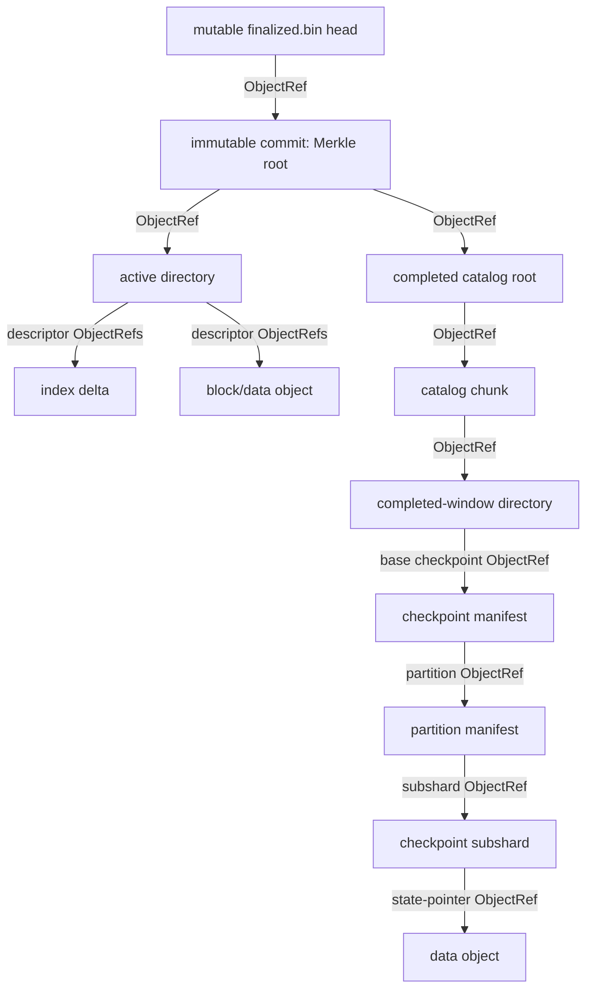

# Content integrity and the Merkle DAG

Fossil's existing content-addressed object graph is a **Merkle DAG**. The root is the
SHA-256 digest of the immutable commit selected by the mutable
`chains/<chain-id>/heads/finalized.bin` head. No second integrity tree or parallel root
is needed.

Every edge between immutable objects is an `ObjectRef(digest, length)` serialized into
the parent object. The digest is SHA-256 over the child's exact stored bytes, and the
length is the exact encoded byte length. Because the parent's digest covers its full
encoding, including its child references, a verified parent authenticates those
references. A child is accepted only after its length and digest match its
`ObjectRef`, followed by its type-specific magic, version, and structural validation.
An object-store key is derived from the digest, but the key alone is not trusted.

## Paths verified by reads



For an active-epoch value, the authenticated path is, for example:

```text
trusted/versioned head
  -> commit ObjectRef(digest,length); verify immutable commit (root)
  -> active_directory ObjectRef; verify directory
  -> epoch index ObjectRef; verify index and its data-reference dictionary
  -> epoch data ObjectRef; verify data, then verify the full logical key/value run
```

For a completed window or a value supplied by its checkpoint, paths are, for example:

```text
commit (root)
  -> completed catalog root -> catalog chunk -> completed-window directory
       -> epoch index/data object

commit (root)
  -> active or completed directory -> base checkpoint manifest
       -> routed partition manifest -> full-key-hash subshard -> pointed data object
```

Normal reads therefore verify only the root-to-leaf paths they use. Startup validates
the bounded head and verifies its commit; later directory, catalog, index, checkpoint,
and data fetches extend verification lazily. Cached objects were verified before admission and
can be discarded and re-fetched without becoming authoritative. Full-key checks and
format invariants remain necessary after digest verification: the Merkle commitment
proves which bytes the root selected, not that arbitrary bytes have valid Fossil
semantics.

## Inclusion evidence and compact proofs

Current inclusion evidence consists of the immutable commit plus every parent object
on the path to the target object (and the trusted commit reference or head that names
the root). This is straightforward to verify offline, but it is not necessarily a
compact sibling-hash proof. Directories and other fanout objects commit encoded arrays
of `ObjectRef`s by hashing the entire parent object; they do not expose a separately
Merkleized tree over array entries.

Format version 1 does not provide a separate compact-proof tree or API. The immutable
commit digest commits to the reachable content-addressed graph.

## Security boundary

Merkle verification provides **internal consistency** for one selected publication:
corruption, substitution, truncation, and inconsistent child references fail closed.
It does not establish any of the following:

- **Publisher authenticity.** SHA-256 is not a signature. The mutable head must be
  trusted, authenticated, and versioned through the deployment's control plane (for
  example, authenticated object-store access plus protected version/rollback state).
  Otherwise an attacker can replace or roll back the head to another internally
  consistent commit. A reader that is given an immutable commit digest out of band can
  use that digest directly as its trust anchor.
- **Canonical-chain correctness or finality.** A dishonest or mistaken exporter can
  publish a self-consistent archive for the wrong chain or fork. Fossil still relies
  on its trusted exporter and finality source; continuity checks are not consensus.
- **EVM state-root validity.** The recorded block state roots are metadata. The Fossil
  DAG is not an Ethereum Merkle-Patricia/Verkle proof and does not prove that archived
  account and storage values reconstruct those roots.
- **Availability.** A digest detects a missing or damaged object but cannot retrieve,
  replicate, or repair it. Backend durability, retention, and operational recovery
  remain separate requirements.
