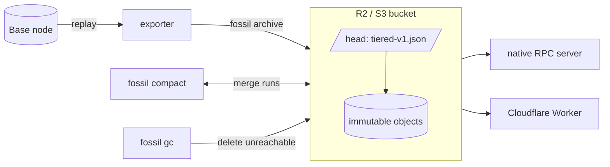
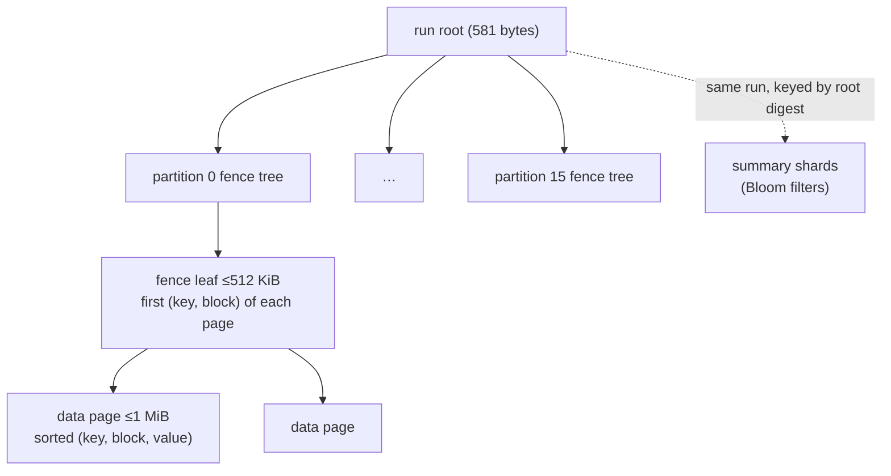
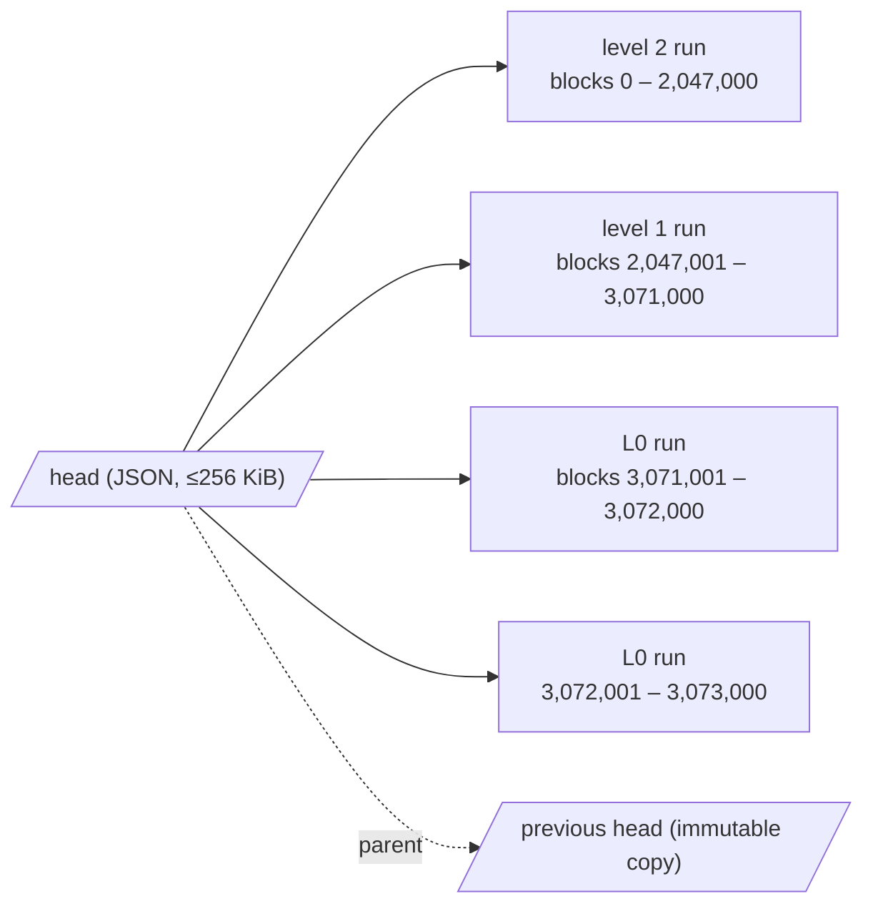
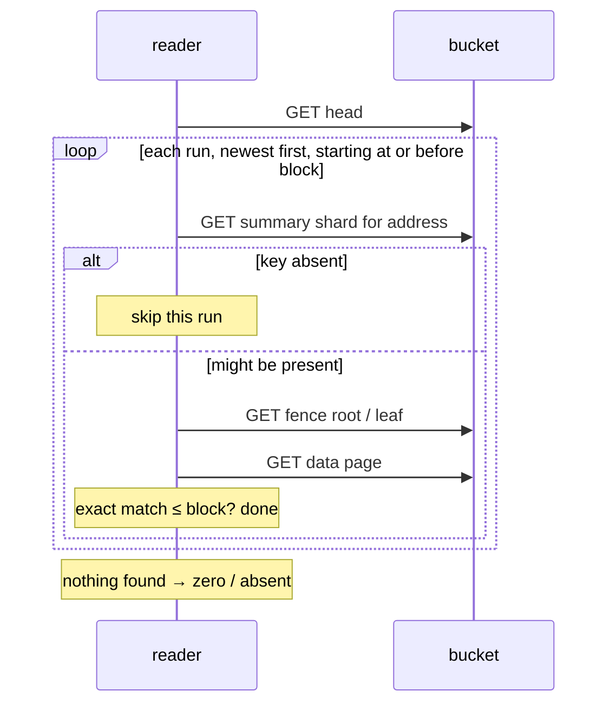
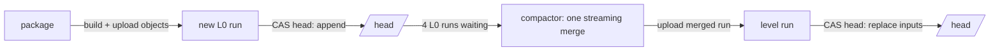
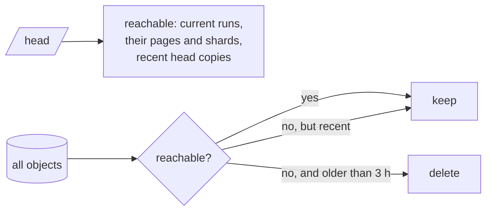

# How Fossil stores history: a visual guide

This page is the picture-first companion to the [format specification](format.md).

## 1. The big picture

A Base node replays finalized blocks. The exporter turns each 1,000-block package into an
immutable **run**. A compactor merges runs in the background. One small mutable **head**
says which runs are current. Readers only ever follow the head.

## 2. What a run contains

A run holds every state version written during its block range, keyed by
`(key, block)`. Keys are `0x01 ‖ address` for accounts, `0x02 ‖ address ‖ incarnation ‖
slot` for storage, and `0x03 ‖ code hash` for code.

- Keys are spread over 16 partitions by hash, so no single object grows without bound.
- A **fence tree** finds the one data page that can hold `key` at or before a block.
- **Summary shards** answer “might this run contain this key?” with no false negatives.
  An account and all of its storage share one shard, so one download covers both.

## 3. The head is the whole table of contents

Runs never overlap in time. Older history lives in a few large runs; recent history
lives in small ones. Because the run list is inline, a reader needs **one GET** to know
everything it will look at.

## 4. Reading `eth_getStorageAt(address, slot, block)`

Storage first resolves the account at that block (for its incarnation), then the slot;
the summary shard fetched for the account is reused for the slot. Cold cost is roughly
**1 + (runs) + 6 GETs**, with a hard cap of 192 GETs and 128 MiB per request.

## 5. Writing: append now, merge later

- Publishing only **appends** a run and swaps the head with compare-and-swap. It never
  waits for merging.
- The compactor folds four L0 runs (and any full level they fill) into one bigger run.
  Level `i` holds up to `4 × 8^i … 4 × 8^(i+1)` epochs, so the run count stays small.
- Either writer can lose a CAS race; it re-reads the head and retries. A reader always
  sees either the old complete head or the new one, never a partial run.
- If 16 L0 runs pile up, publishing pauses until the compactor catches up.

## 6. Cleaning up

Merged inputs stay in the bucket until `fossil gc` removes them:

GC runs safely next to the exporter and compactor: new uploads are protected by the
3-hour grace period, and writers re-stamp any old object they reuse.
